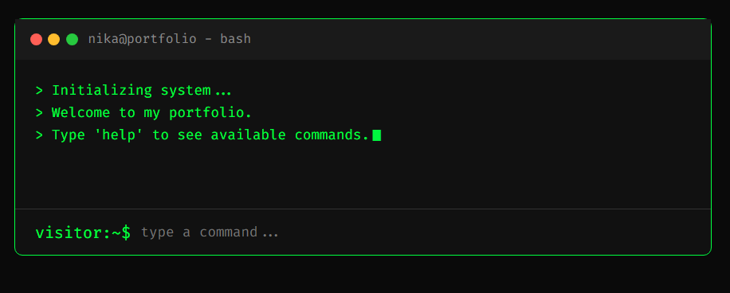

# hi, welcome to my portfolio  


# Terminal 
A  portfolio built to look and feel like a classic Linux terminal.




## Live Demo
[Check out the live terminal here](https://sooraj44882.github.io/portfolio/)

## Quick Start
Once you open the link, you can interact with the portfolio by typing commands. Try these out:
- `help` - Shows a list of available commands
- `whoami` - A little background about me
- `skills` - My current tech stack
- `clear` - Wipes the terminal screen

## Features
- Fully interactive command-line interface right in the browser.
- Cool typing animations .
- Custom command parsing to handle user inputs and spit out the right responses.

## Running it Locally
Since this is built with standard web tech, you don't need any complex package managers or build tools to run it on your own machine.

1. Clone the repo:
   ```bash
   git clone [https://github.com/sooraj44882/portfolio.git](https://github.com/sooraj44882/portfolio.git)

2. Move into the directory:
   ```bash
   cd portfolio


